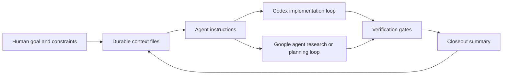

# Gemini/Codex Durable Context Workflow

Public documentation shell for a private AI-assisted workflow system that coordinates durable project context, agent handoffs, validation gates, and session closeout across Codex and Google agent tooling.

The private implementation is not public because it contains local machine configuration, credentials surfaces, workflow logs, and private automation context. This repository documents the architecture, privacy boundaries, and sanitized operating model without exposing sensitive files or machine-specific setup.

## What This Demonstrates

- Durable context design using repository-managed Markdown files instead of relying only on chat history.
- Agent handoff patterns between implementation-focused and research/planning-focused assistants.
- Validation gates for linting, testing, git hygiene, secret avoidance, and documentation closeout.
- Privacy-first public documentation for a private automation workflow.
- Migration planning as Google transitions consumer Gemini CLI workflows to Antigravity CLI.

## Why It Exists

Long-running AI-assisted development can lose continuity when work is split across sessions, tools, machines, and models. The private workflow behind this documentation shell is designed to keep work recoverable and auditable by storing key operating context in files such as:

- project goals and constraints
- decisions and open questions
- agent instructions
- verification commands
- closeout summaries
- next-action queues

The goal is not full autonomy for its own sake. The goal is safer assisted execution: clear intent, explicit boundaries, repeatable checks, and a written trail of what changed and why.

## Current Tooling Direction

Google announced that Gemini CLI and Gemini Code Assist IDE extensions will stop serving requests for Google AI Pro, Ultra, and free individual users on June 18, 2026. Google identifies Antigravity CLI as the replacement terminal experience for those workflows.

The private workflow is being planned around an adapter-based approach:

- preserve `AGENTS.md`, `GEMINI.md`, and durable context files where supported
- keep Codex CLI workflows intact
- add Antigravity CLI support without blindly renaming every Gemini command
- move workspace skills toward `.agents/skills`
- move MCP examples toward Antigravity-compatible `mcp_config.json` templates
- avoid committing local credentials, tokens, or machine-specific settings

Public sources:

- [Google Developers Blog: Transitioning Gemini CLI to Antigravity CLI](https://developers.googleblog.com/en/an-important-update-transitioning-gemini-cli-to-antigravity-cli/)
- [Antigravity CLI migration guide](https://www.antigravity.google/docs/gcli-migration)
- [Antigravity CLI overview](https://www.antigravity.google/docs/cli-overview)
- [Antigravity CLI getting started](https://www.antigravity.google/docs/cli-getting-started)

## Public vs. Private Boundary

This public repository may include:

- architecture summaries
- sanitized workflow diagrams
- high-level operating checklists
- migration notes
- privacy and safety principles
- public-safe examples with fake paths and placeholder credentials

This public repository will not include:

- local machine configuration
- API keys, tokens, or `.env` files
- private MCP server settings
- workflow logs with private paths or account details
- raw automation output
- private resume, job-search, or financial materials
- implementation scripts before a privacy review

## Architecture Overview

The private system treats the repository as the source of truth. Assistants can resume from written context, run defined checks, and record what remains open before the next session.

## Example Context Files

The exact private files vary by project, but the pattern is:

| File | Purpose |
| --- | --- |
| `AGENTS.md` | Agent operating rules, repo boundaries, safety constraints, and verification expectations. |
| `GEMINI.md` | Google-agent-facing context where needed. |
| `PROJECT_CONTEXT.md` | Durable project summary and current goals. |
| `DECISIONS.md` | Decisions already made so old debates do not restart. |
| `OPEN_QUESTIONS.md` | Questions requiring human judgment. |
| `NEXT_ACTIONS.md` | Ordered queue of work that can be resumed safely. |
| `CHANGELOG.md` | Human-readable closeout log of meaningful changes. |

## Validation Gates

A typical closeout checks:

1. Git status is understood before staging.
2. Only intended files are changed.
3. Sensitive files are absent from the diff.
4. Lint/build/test commands pass where applicable.
5. Documentation reflects the current state.
6. Commits are coherent and pushed only after review.

For private or sensitive work, validation also includes explicit scans for `.env`, keys, tokens, credentials, raw documents, private financial data, and machine-specific configuration.

## Recruiter-Relevant Skills Demonstrated

- Workflow automation
- Documentation systems
- AI-assisted development operations
- Git hygiene and release discipline
- Privacy-aware technical communication
- Cross-tool migration planning
- Structured validation and handoff design

## Status

This is a documentation shell for a private implementation. The next public-safe improvements are:

- add a sanitized workflow diagram under `docs/`
- add a fake example context pack
- add a privacy-reviewed migration checklist for Antigravity CLI
- add screenshots only if they do not expose local paths, credentials, private repos, or personal data
