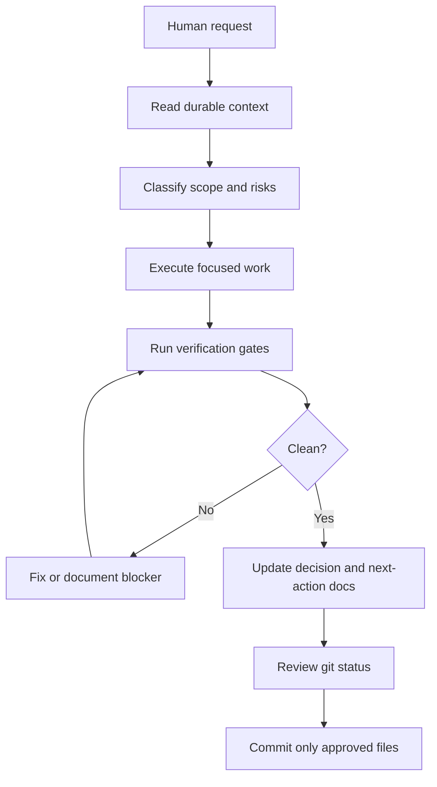

# Sanitized Workflow Artifact

This artifact shows the public-safe operating model behind the private Gemini/Codex workflow system.

It uses fake project names, fake paths, and placeholder commands. It does not expose private machine configuration, credentials, raw logs, transcripts, employer material, financial data, or implementation scripts.

## Professional Snapshot

The private workflow is designed to make AI-assisted development more auditable:

- goals and constraints are written before work starts,
- agents inherit durable context from files instead of only chat memory,
- changes are verified through explicit checks,
- sensitive files are scanned before commits,
- session closeout records what changed and what remains open.

This demonstrates workflow automation, documentation discipline, Git hygiene, validation design, and privacy-aware technical communication.

## Public-Safe Workflow

## Example Gates

| Gate | Purpose | Public-safe placeholder command |
| --- | --- | --- |
| Git state | Avoid staging unrelated or nested repo changes | `git status --short --branch` |
| Diff hygiene | Catch whitespace and conflict markers | `git diff --check` |
| Sensitive-file scan | Prevent accidental exposure | `find . -path ./.git -prune -o -type f \\( -iname '*.env' -o -iname '*token*' -o -iname '*secret*' \\) -print` |
| Project checks | Prove app or docs still work | `npm run lint && npm run build` |
| Closeout | Make the next session resumable | update `CHANGELOG.md` and `NEXT_ACTIONS.md` |

## Handoff Pattern

Each session should leave behind:

1. The current goal.
2. The files changed.
3. The commands run.
4. The tests or checks passed.
5. The decisions made.
6. The known risks or blockers.
7. The next safest action.

## Privacy Boundary

Public examples may include:

- fake project names,
- synthetic paths,
- placeholder command names,
- diagrams,
- checklists,
- sanitized architecture notes.

Public examples must not include:

- `.env` files,
- API keys or tokens,
- local machine config,
- private repo paths,
- workflow logs,
- employer proprietary details,
- banking, brokerage, or private financial data,
- raw resumes or transcripts.

## Why This Matters

AI-assisted work is only useful professionally if it is repeatable, reviewable, and safe. The value of this workflow is not just using an assistant. The value is building a controlled operating system around the assistant: context, constraints, validation, and documented closeout.
